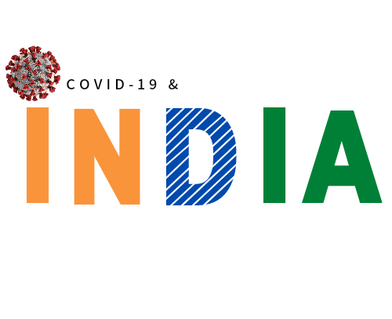
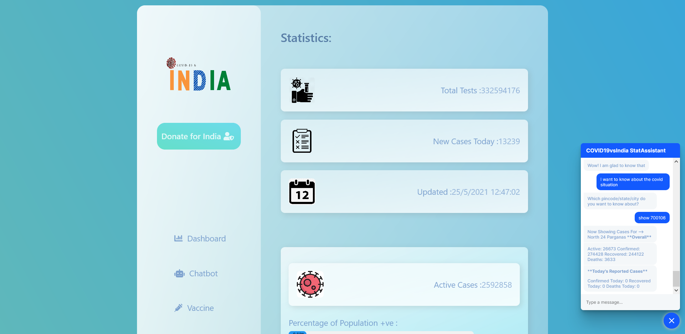
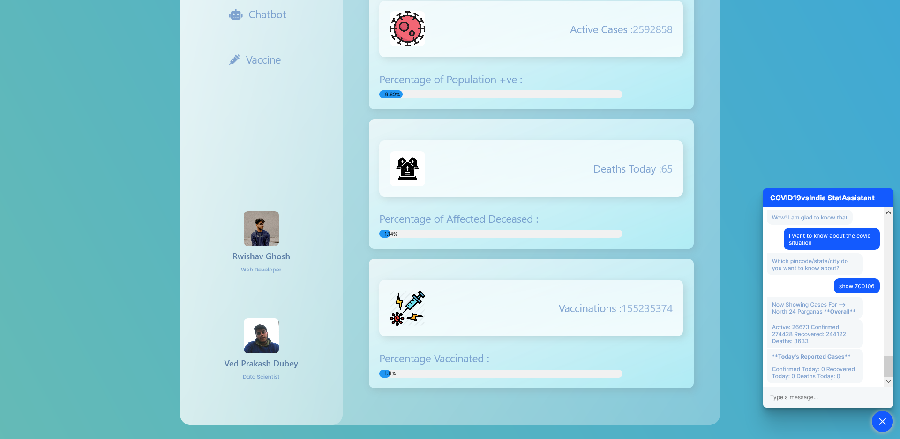
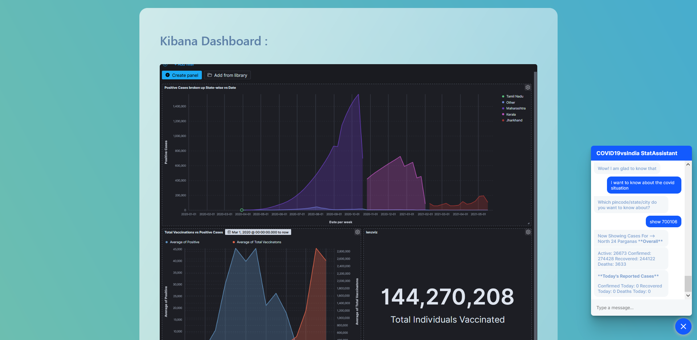
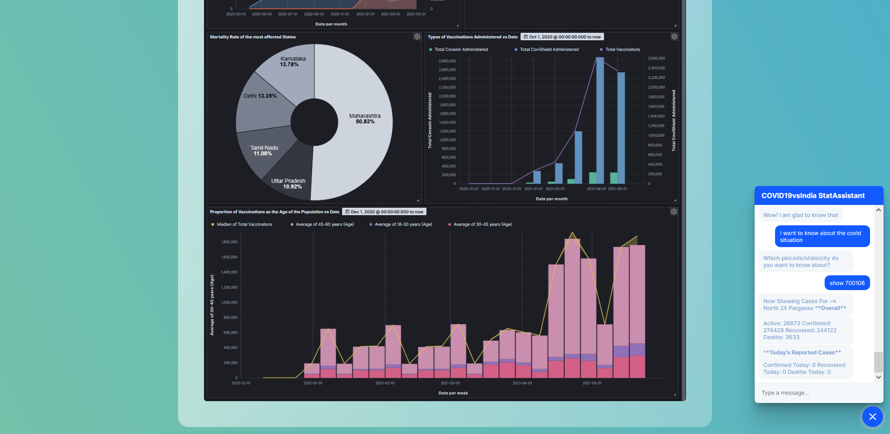

<!--
*** Thanks for checking out the Best-README-Template. If you have a suggestion
*** that would make this better, please fork the repo and create a pull request
*** or simply open an issue with the tag "enhancement".
*** Thanks again! Now go create something AMAZING! :D
***
***
***
*** To avoid retyping too much info. Do a search and replace for the following:
*** github_username, repo_name, twitter_handle, email, project_title, project_description
-->


<!-- PROJECT SHIELDS -->
<!--
*** I'm using markdown "reference style" links for readability.
*** Reference links are enclosed in brackets [ ] instead of parentheses ( ).
*** See the bottom of this document for the declaration of the reference variables
*** for contributors-url, forks-url, etc. This is an optional, concise syntax you may use.
*** https://www.markdownguide.org/basic-syntax/#reference-style-links
-->
[![Contributors][contributors-shield]][contributors-url]
[![Forks][forks-shield]][forks-url]


<!-- PROJECT LOGO -->
<br />
<p align="center">
  <a href="https://rwishavg.github.io/COVID-19-and-India/frontend/index.html">
    
  </a>

  <h3 align="center">COVID-19 & India</h3>

  <p align="center">
    An Analytical and Interactive Approach
    <h3 align="center">Dashboard is Not compatible with Chrome</h3>
    <br />
    <a href="https://youtu.be/BTZSivNDwPM">View Demo</a>
    ·
    <a href="https://github.com/rwishavg/COVID-19-and-India/issues">Report Bug</a>
    ·
    <a href="https://github.com/rwishavg/COVID-19-and-India/issues">Request Feature</a>
  </p>
</p>


<!-- ABOUT THE PROJECT -->
## About The Project

The recent surge in cases of covid-19 due to the second wave of the pandemic has created a crisis within the country. This calls for an analysis of how we've been handling the initial wave, how we are doing currently and what we can potentially do in the future. It is also important to make this information accessible to the people and that is what we aim to achieve with this project. 


## Tech Stack

* [Elasticsearch and Kibana](https://www.elastic.co/)
* [HTML5, CSS3, Javascript](https://www.w3schools.com/html/html_scripts.asp)
* [Flask](https://flask-doc.readthedocs.io/en/latest/)
* [RASA-NLU Chatbot](https://rasa.com/docs/)


<!-- GETTING STARTED -->
## Getting Started

To get a local copy up and running follow these simple steps.

### Installation

* Setting up the RASA chatbot server:

  1. cd to the RASA folder

      ```sh
      cd
      cd ChatBotRasa EW
      ```

  2. Install prerequisite packages

      ```sh
      pip install rasa-x -i https://pypi.rasa.com/simple
      ```

  3. Run RASA server at a deployable localhost endpoint

      ```sh
      rasa run -m models --enable-api --cors “*” --debug
      ```

* Setting up the web application :

  1. Clone the repo

      ```sh
      git clone https://github.com/rwishavg/COVID-19-and-India.git
      ```

  2. cd to the Flask folder

        ```sh
        cd backend
        ```

  3. Create a virtual environment and activate it
    
      ```sh
        conda create -n venv python=3.6
        activate venv
      ```

  4. Install prerequisite packages

      ```sh
      pip install flask
      ```


<!-- USAGE EXAMPLES -->
## Application in Use

### Salient Features
1. Implementing the Elastic stack in particular Elasticsearch and Kibana in order to perform data analysis and present impactful visualizations through the Kibana dashboard.
2. Displaying Covid statistics that update in real time by reading from API's.
3. Building a RASA chatbot by training it on custom interaction and also enabling it to update the user with location specific pandemic statistics.









<!-- ROADMAP -->
## Roadmap

1. Data preprocessing and sending the data to Elasticsearch using Bulk API.
2. Analyzing the data using Kibana, and creating a dashboard of visualizations using it.
3. Created an embeddable link of the dashboard.
4. At this time the front-end of the website had been completed.
5. Implemented live data update of COVID19 by writing scripts to read API's generated by scraping the web. Parsed the API into .JSON files and extracted data from them.
6. Built a chatbot using RASA and Python, trained it on custom interaction, to make it handle general conversation. It is a chatbot that provides the user with the up-to-date pandemic stats which is location specific. 
7. All of the individual modules were integrated, and deployed to the localhost using Flask.


<!-- LICENSE -->
## License

Distributed under the MIT License. See [LICENSE](https://github.com/rwishavg/COVID-19-and-India/blob/main/LICENSE) for more information.


<!-- CONTACT -->
## Contributors

[Ved Prakash Dubey](https://www.linkedin.com/in/ved-prakash-dubey-swash/) - Linkedin

[Rwishav Ghosh](https://rwishavg.github.io/portfolio/) - Portfolio


<!-- ACKNOWLEDGEMENTS -->
## Acknowledgements

* [Kaggle](https://www.kaggle.com/sudalairajkumar/covid19-in-india)
* [Code for Cause](https://codeforcause.org/)
* [Elastic](https://www.elastic.co/)


<!-- MARKDOWN LINKS & IMAGES -->
<!-- https://www.markdownguide.org/basic-syntax/#reference-style-links -->
[contributors-shield]: https://img.shields.io/github/contributors/rwishavg/indiaVScovid.svg?style=for-the-badge
[contributors-url]: https://github.com/rwishavg/COVID-19-and-India/graphs/contributors
[forks-shield]: https://img.shields.io/github/forks/rwishavg/indiaVScovid.svg?style=for-the-badge
[forks-url]: https://github.com/rwishavg/COVID-19-and-India/network/members
